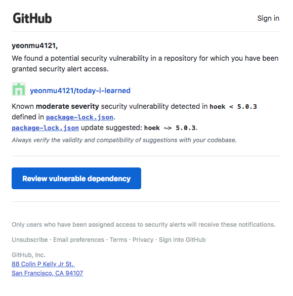
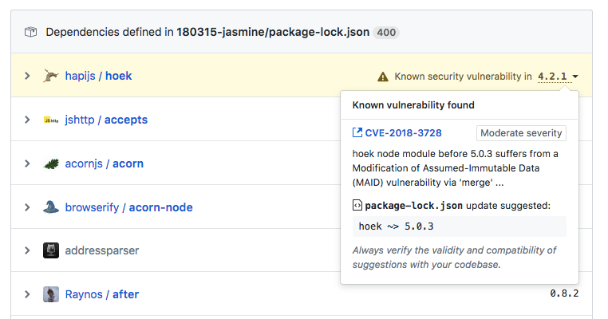
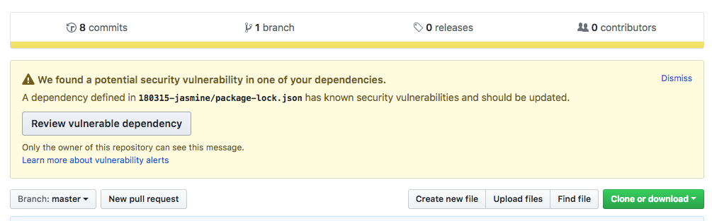
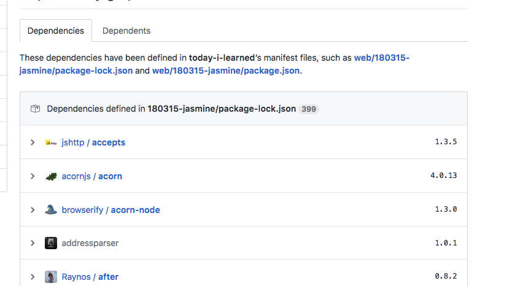

# github에서 패키지 의존성 보안 이슈 해결하기

오늘 아침, github에서 이런 메일이 왔다.

TIL을 작성하면서 테스트 코드를 작성했었는데, 거기에 있는 패키지 하나가 보안적으로 문제가 있다는 모양이다.

링크를 클릭하면 이렇게 뜬다. `4.2.1`에 밑줄이 있는데, 클릭하면 최소 어느 버전까지 버전업을 해야 하는지 확인할 수 있다.

저장소에 들어가도 이런 식으로 문제가 있다는 것을 확인할 수 있다.

`npm audit fix`라는 커맨드로 수정 가능하다. 혹 문제가 발생할 경우, `--force` 옵션을 붙여 해결하자.

이슈가 해결되면 경고 마크가 사라진다.
